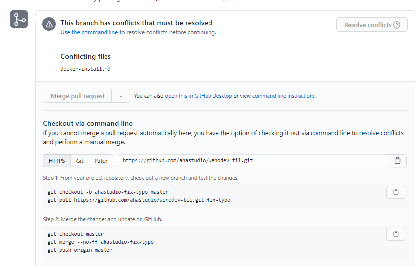

# Conflict 해결하기

아샬님께서 PR을 날려주셔 conflict 상황을 경험할 수 있었다.


##STEP 1
###브랜치 생성
```git
git checkout -b ahastudio-fix-typo master
```

###fork한 레포에서 작업한 내용 받기
```git
git pull https://github.com/ahastudio/wenodev-til.git fix-typo
```

##SETP 2
###브랜치 변경
```git
git checkout master
```
### merge
```git
git merge --no-ff ahastudio-fix-typo
```
### push
```git
git push origin master
```

참고자료
1. git-scm : https://git-scm.com/docs/git-checkout
2. git-scm : https://git-scm.com/docs/git-merge
3. 누구나 쉽게 이해할 수 있는 Git입문 : https://backlog.com/git-tutorial/kr/stepup/stepup1_4.html
